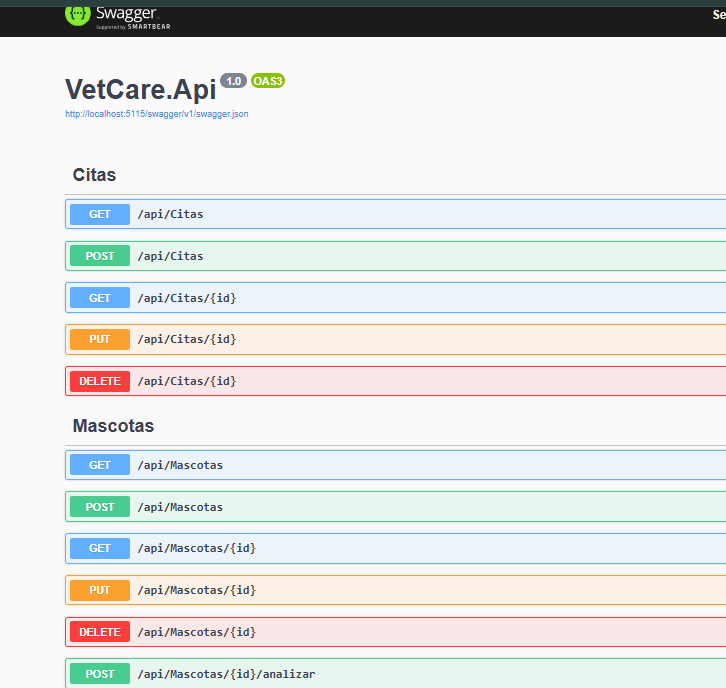
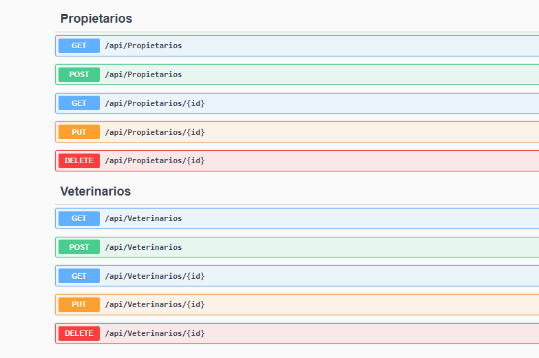
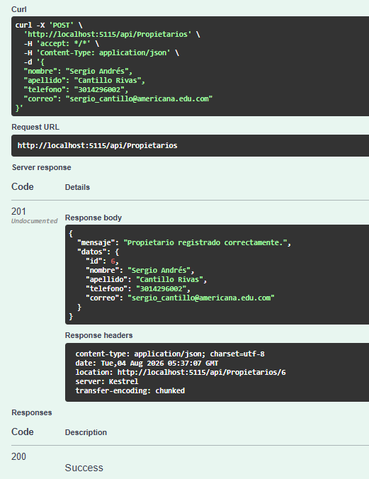
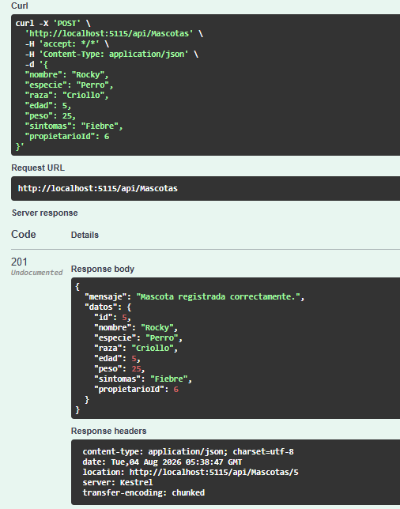
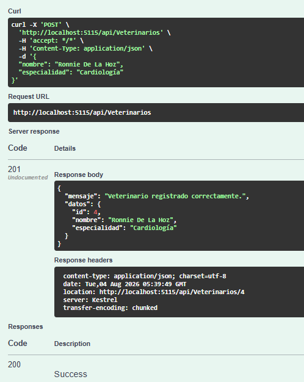
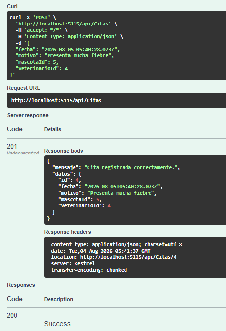
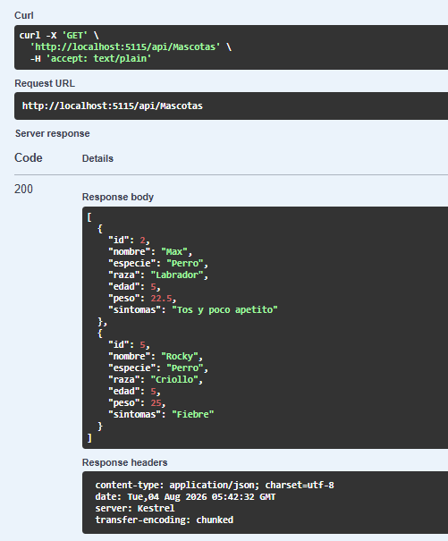
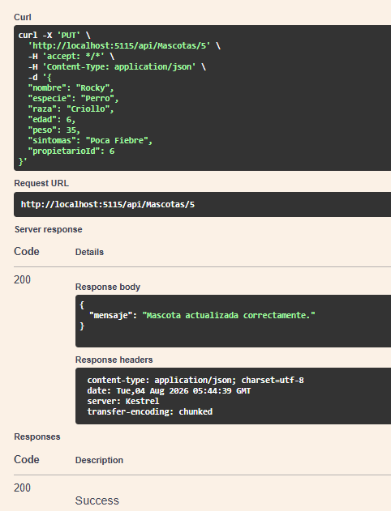
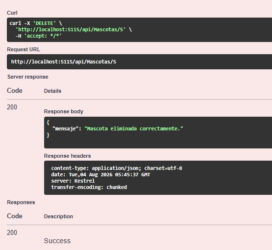
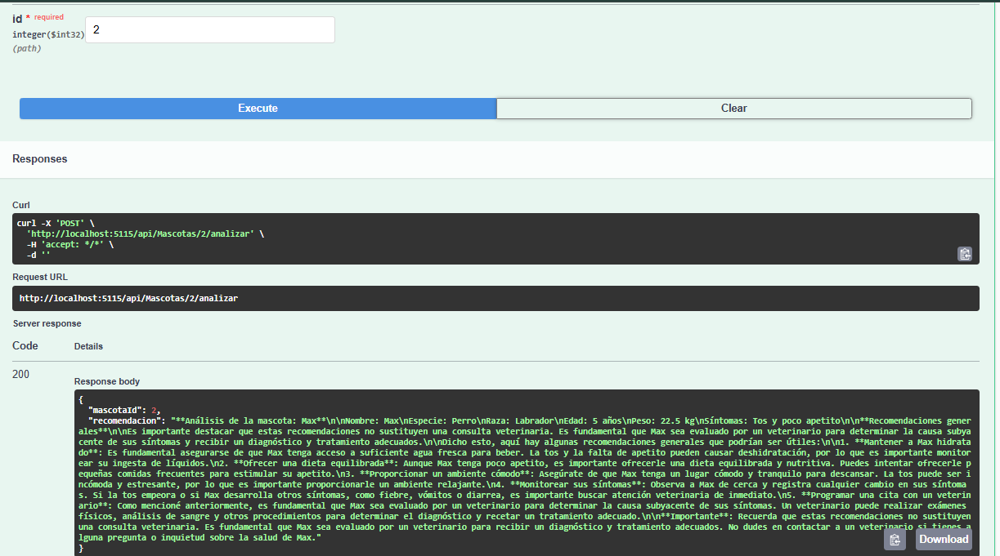

<!-- Badges -->
<p align="center">

<a href="https://dotnet.microsoft.com/" target="_blank">
    
</a>

<a href="https://dotnet.microsoft.com/apps/aspnet" target="_blank">
    
</a>

<a href="https://learn.microsoft.com/ef/core/" target="_blank">
    
</a>

<a href="https://www.sqlite.org/" target="_blank">
    
</a>

<a href="https://groq.com/" target="_blank">
    
</a>

<a href="https://opensource.org/license/mit" target="_blank">
    
</a>

</p>

```text
██╗   ██╗███████╗████████╗ ██████╗ █████╗ ██████╗ ███████╗
██║   ██║██╔════╝╚══██╔══╝██╔════╝██╔══██╗██╔══██╗██╔════╝
██║   ██║█████╗     ██║   ██║     ███████║██████╔╝█████╗
╚██╗ ██╔╝██╔══╝     ██║   ██║     ██╔══██║██╔══██╗██╔══╝
 ╚████╔╝ ███████╗   ██║   ╚██████╗██║  ██║██║  ██║███████╗
  ╚═══╝  ╚══════╝   ╚═╝    ╚═════╝╚═╝  ╚═╝╚═╝  ╚═╝╚══════╝

              Veterinary Management REST API
```

# VetCare API
### Sistema de Gestión Veterinaria

Sistema de gestión veterinaria desarrollado con **ASP.NET Core 8 Web API**, **Entity Framework Core** y **SQLite**, orientado a la administración de propietarios, mascotas, veterinarios y citas médicas mediante una arquitectura REST.

Además, integra **Groq AI** para generar recomendaciones veterinarias generales a partir de los síntomas registrados de una mascota.

---


## Tabla de contenido

- [Descripción](#descripción)
- [Características principales](#características-principales)
- [Tecnologías utilizadas](#tecnologías-utilizadas)
- [Requisitos del sistema](#requisitos-del-sistema)
- [Instalación](#instalación)
- [Configuración del proyecto](#configuración-del-proyecto)
- [Endpoints disponibles](#endpoints-disponibles)
- [Integración con Inteligencia Artificial](#integración-con-inteligencia-artificial)
- [Estructura del proyecto](#estructura-del-proyecto)
- [Ejemplos de uso](#ejemplos-de-uso)
- [Capturas de pantalla](#capturas-de-pantalla)
- [Autores](#autores)
- [Licencia](#licencia)

---

## Descripción

**VetCare API** fue desarrollada como proyecto final del **Diplomado de Programación con .NET**.

Su objetivo es aplicar los conocimientos adquiridos en el desarrollo de una API REST, implementando operaciones CRUD, persistencia de datos con Entity Framework Core y SQLite, documentación con Swagger e integración de Inteligencia Artificial mediante Groq.

---

## Características principales

- API REST desarrollada con ASP.NET Core 8.
- Persistencia de datos utilizando Entity Framework Core y SQLite.
- Operaciones CRUD para todas las entidades.
- Arquitectura organizada mediante Controllers, Models, DTOs y Data.
- Validaciones utilizando Data Annotations.
- Documentación interactiva mediante Swagger.
- Integración con Groq AI para generar recomendaciones veterinarias.
- Respuestas HTTP con mensajes claros y códigos de estado apropiados.

---

## Tecnologías utilizadas

| Tecnología | Descripción |
|------------|-------------|
| ASP.NET Core 8 | Framework para el desarrollo de la API REST. |
| C# | Lenguaje de programación utilizado en el proyecto. |
| Entity Framework Core | ORM para el acceso y manipulación de la base de datos. |
| SQLite | Motor de base de datos ligero utilizado por la aplicación. |
| Swagger / OpenAPI | Documentación y pruebas de los endpoints. |
| Groq AI | Servicio de Inteligencia Artificial para generar recomendaciones veterinarias. |
| Visual Studio Code | Entorno de desarrollo utilizado. |
| Git y GitHub | Control de versiones y alojamiento del repositorio. |

---

## Requisitos del sistema

Antes de ejecutar el proyecto es necesario tener instalado:

- .NET SDK 8.0 o superior.
- Git.
- Visual Studio Code o Visual Studio 2022.
- SQLite (opcional, para consultar la base de datos).
- Una API Key de Groq para utilizar el servicio de Inteligencia Artificial.

---

## Instalación

### 1. Clonar el repositorio

```bash
git clone https://github.com/sergio-cantillo/VetCare-API.git
```

### 2. Entrar al proyecto

```bash
cd VetCare-API
```

### 3. Restaurar las dependencias

```bash
dotnet restore
```

### 4. Ejecutar las migraciones

```bash
dotnet ef database update --project VetCare.Api
```

### 5. Ejecutar la aplicación

```bash
dotnet run --project VetCare.Api
```

### 6. Abrir Swagger

Una vez iniciada la aplicación, abre en el navegador la dirección que aparece en la consola, por ejemplo:

```text
https://localhost:7000/swagger
```

> **Nota:** El puerto puede variar según la configuración del entorno de desarrollo.

---

## Configuración del proyecto

Antes de ejecutar la aplicación es necesario configurar los siguientes elementos:

### Base de datos

La API utiliza **SQLite** como motor de base de datos.

La cadena de conexión se encuentra en:

```text
VetCare.Api/appsettings.json
```

```json
"ConnectionStrings": {
  "DefaultConnection": "Data Source=VetCare.db"
}
```

---

### Clave de Groq AI

Para utilizar el análisis inteligente de mascotas se debe registrar una API Key de Groq.

Dentro de `appsettings.json`:

```json
"Groq": {
  "ApiKey": "TU_API_KEY"
}

```

---

## Endpoints disponibles

### Propietarios

| Método | Endpoint | Descripción |
|---------|----------|-------------|
| GET | `/api/Propietarios` | Listar propietarios |
| GET | `/api/Propietarios/{id}` | Buscar propietario |
| POST | `/api/Propietarios` | Registrar propietario |
| PUT | `/api/Propietarios/{id}` | Actualizar propietario |
| DELETE | `/api/Propietarios/{id}` | Eliminar propietario |

### Mascotas

| Método | Endpoint | Descripción |
|---------|----------|-------------|
| GET | `/api/Mascotas` | Listar mascotas |
| GET | `/api/Mascotas/{id}` | Buscar mascota |
| POST | `/api/Mascotas` | Registrar mascota |
| PUT | `/api/Mascotas/{id}` | Actualizar mascota |
| DELETE | `/api/Mascotas/{id}` | Eliminar mascota |
| POST | `/api/Mascotas/{id}/analizar` | Obtener recomendación con IA |

### Veterinarios

| Método | Endpoint | Descripción |
|---------|----------|-------------|
| GET | `/api/Veterinarios` | Listar veterinarios |
| GET | `/api/Veterinarios/{id}` | Buscar veterinario |
| POST | `/api/Veterinarios` | Registrar veterinario |
| PUT | `/api/Veterinarios/{id}` | Actualizar veterinario |
| DELETE | `/api/Veterinarios/{id}` | Eliminar veterinario |

### Citas

| Método | Endpoint | Descripción |
|---------|----------|-------------|
| GET | `/api/Citas` | Listar citas |
| GET | `/api/Citas/{id}` | Buscar cita |
| POST | `/api/Citas` | Registrar cita |
| PUT | `/api/Citas/{id}` | Actualizar cita |
| DELETE | `/api/Citas/{id}` | Eliminar cita |

---

## Integración con Inteligencia Artificial

Una de las principales funcionalidades de **VetCare API** es la integración con **Groq AI**, la cual permite analizar la información registrada de una mascota para generar recomendaciones veterinarias generales.

La IA utiliza información como:

- Nombre
- Especie
- Raza
- Edad
- Peso
- Síntomas

Con estos datos genera una respuesta orientativa, aclarando que **no reemplaza el diagnóstico realizado por un médico veterinario**.

### Endpoint

```
POST /api/Mascotas/{id}/analizar
```

La respuesta incluye recomendaciones generales basadas en los síntomas registrados para la mascota seleccionada.

---

## Estructura del proyecto

```text
VetCare-API
│
├── assets                              # Capturas utilizadas en el README
│ 
├── VetCare.Api
│   ├── AI
│   │   └── GroqService.cs              # Servicio de integración con Groq AI
│   │
│   ├── Controllers
│   │   ├── CitasController.cs          # CRUD de citas
│   │   ├── MascotasController.cs       # CRUD de mascotas y análisis con IA
│   │   ├── PropietariosController.cs   # CRUD de propietarios
│   │   └── VeterinariosController.cs   # CRUD de veterinarios
│   │
│   ├── Data
│   │   └── VetCareDbContext.cs         # Contexto de Entity Framework Core
│   │
│   ├── DTOs
│   │   ├── CitaCrearDto.cs             # DTO para crear citas
│   │   ├── CitaRespuestaDto.cs         # DTO de respuesta de citas
│   │   ├── MascotaActualizarDto.cs     # DTO para actualizar mascotas
│   │   ├── MascotaCrearDto.cs          # DTO para crear mascotas
│   │   ├── MascotaRespuestaDto.cs      # DTO de respuesta de mascotas
│   │   ├── PropietarioCrearDto.cs      # DTO para crear propietarios
│   │   ├── PropietarioRespuestaDto.cs  # DTO de respuesta de propietarios
│   │   ├── VeterinarioCrearDto.cs      # DTO para crear veterinarios
│   │   └── VeterinarioRespuestaDto.cs  # DTO de respuesta de veterinarios
│   │
│   ├── Migrations                     # Migraciones de Entity Framework Core
│   │
│   ├── Models
│   │   ├── Cita.cs                    # Modelo de citas
│   │   ├── Mascota.cs                 # Modelo de mascotas
│   │   ├── Propietario.cs             # Modelo de propietarios
│   │   └── Veterinario.cs             # Modelo de veterinarios
│   │
│   ├── appsettings.json              # Configuración de la aplicación
│   ├── Program.cs                    # Configuración principal de la API
│   └── VetCare.Api.csproj            # Proyecto ASP.NET Core
│
├── README.md                         # Documentación del proyecto
├── Taller-Proyecto-Final.md          # Documento del proyecto
├── global.json                       # SDK de .NET utilizado
├── .gitignore                        # Archivos ignorados por Git
└── VetCare.sln                       # Solución de Visual Studio
```

---

## Ejemplos de uso

Durante las pruebas realizadas mediante Swagger se verificó el correcto funcionamiento de los principales endpoints de la API:

- Registro de propietarios.
- Registro de mascotas asociadas a un propietario.
- Registro de veterinarios.
- Registro de citas médicas.
- Consulta de registros individuales y listados completos.
- Actualización de la información registrada.
- Eliminación de registros.
- Generación de recomendaciones veterinarias mediante Inteligencia Artificial (Groq).

---

## Capturas de pantalla

A continuación se presentan algunas evidencias del funcionamiento del sistema.

### Swagger




---

### Registro de propietario



---

### Registro de mascota



---

### Registro de veterinario



---

### Registro de cita



---

### Consultar mascotas



---

### Actualizar mascota



---

### Eliminar mascota



---

### Análisis con IA



---

## Autores

- Sergio Andrés Cantillo Rivas
- Abdías Martínez De Arco
- Ronnie De La Hoz Fontalvo
- Santiago Caballero Castro
- Isaac Caraballo Villalba

---

## Licencia

Este proyecto se distribuye bajo la licencia **MIT**.

Fue desarrollado con fines académicos como parte del **Diplomado de Programación con .NET**.